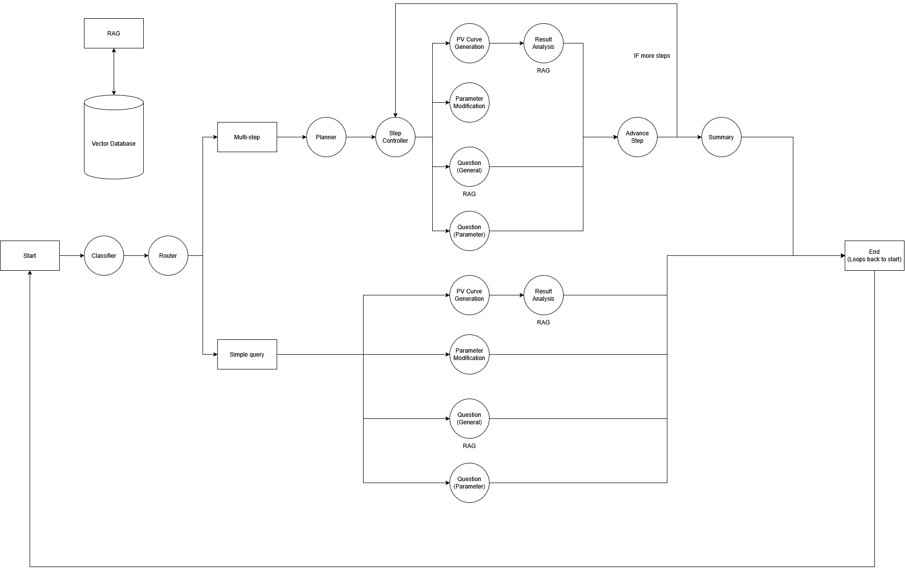

# PV Curve Agent: AI-Powered Voltage Stability Analysis


**Conversational agent for power system voltage stability analysis through PV curve generation and AI analysis**

[](https://github.com/CURENT/pv-curve-llm/blob/master/LICENSE)
[](https://www.repostatus.org/#active)
[](https://github.com/CURENT/pv-curve-llm/commits/master/)
[](https://visitorbadge.io/status?path=https%3A%2F%2Fgithub.com%2FCURENT%2Fpv-curve-llm)
[](https://www.python.org/downloads/)

## Table of Contents

- [Overview](#overview)
- [Key Features](#key-features)
- [Architecture](#architecture)
- [Installation](#installation)
- [Quick Start](#quick-start)
- [Usage Examples](#usage-examples)
- [LangGraph Workflow](#langgraph-workflow)
- [Node Reference](#node-reference)
- [Configuration](#configuration)
- [Project Structure](#project-structure)
- [License](#license)
- [Acknowledgments](#acknowledgments)

## Overview

The **PV Curve Agent** is an AI-powered system that brings natural language interaction to power system voltage stability analysis. Built on LangGraph and LangChain, it combines conversational AI with power system simulation to make voltage stability analysis accessible and intelligent.

This project is part of the **CURENT Large-scale Testbed (LTB)** research initiative, exploring how modern AI frameworks and large language models can be integrated into power system analysis workflows. The agent uses a sophisticated multi-agent architecture to understand user intent, manage parameters, generate comprehensive voltage stability analyses through PV (Power-Voltage) curve generation, and provide analysis on the results.

**What it does:**

- Generates PV curves (nose curves) for voltage stability analysis on IEEE test systems
- Provides conversational interface for parameter modification and exploration
- Offers intelligent analysis and explanations using retrieval-augmented generation (RAG)
- Handles complex multi-step workflows with automatic task decomposition

**Why it exists:**

- Research AI integration pathways for CURENT LTB
- Demonstrate practical applications of LLM agents in power systems
- Lower the barrier to entry for voltage stability analysis
- Experiment with agentic workflows for domain-specific engineering tasks

**Technology Stack:**

- **Agent Framework**: LangGraph, LangChain
- **LLMs**: OpenAI (o3-mini), Ollama (local models)
- **Power Simulation**: pandapower
- **Knowledge Base**: Chroma vector database with RAG
- **Validation**: Pydantic models with structured outputs

## Key Features

### 🤖 Intelligent Agent System

- **Multi-Agent Orchestration**: LangGraph-based workflow with 11 specialized nodes
- **Natural Language Interface**: Ask questions, modify parameters, and request analyses conversationally
- **RAG-Enhanced Intelligence**: Vector database storing power systems knowledge for context-aware responses
- **Structured Outputs**: Pydantic schemas ensure reliable, type-safe agent responses

### ⚡ Power System Analysis

- **IEEE Test Systems**: Support for IEEE 14/24/30/39/57/118/300 bus systems from pandapower
- **PV Curve Generation**: Automated voltage stability analysis using pandapower
- **Comprehensive Metrics**: Load margin (MW), nose point voltage, convergence analysis, and more
- **Visual Output**: Matplotlib plots

### 🔄 Advanced Workflow Capabilities

- **Multi-Step Planning**: Automatically decomposes complex queries into executable action sequences
- **Error Recovery**: Intelligent error handling with retry mechanisms and auto-correction
- **Context Awareness**: Maintains conversation history and enables comparative analysis across queries
- **Adaptive Routing**: Conditional workflow paths based on query complexity and state

### 🎯 Flexible Deployment

- **Multiple LLM Providers**: Choose between OpenAI API (recommended) or Ollama local models
- **Session Management**: Persistent conversation storage with JSON-based history
- **Extensible Architecture**: Modular design enables easy addition of new capabilities

## Architecture

### System Overview

The PV Curve Agent uses a graph-based architecture powered by LangGraph, where nodes represent specialized agents and edges define the flow of execution. This enables complex, stateful, multi-agent workflows with dynamic routing and error recovery.



### Core Components

#### 1. State Management (`agent/state/`)

The system maintains a shared, typed state object that flows through the entire workflow:

```python
State = {
    messages: List[AIMessage | HumanMessage],
    message_type: str | None,
    inputs: Inputs,
    results: dict | None,
    error_info: dict | None,
    plan: MultiStepPlan | None,
    current_step: int,
    step_results: List[dict],
    is_compound: bool,
    retry_count: int,
    failed_node: str | None,
    conversation_context: List[dict]
}
```

- **TypedDict-based**: Ensures type safety across all nodes
- **Pydantic Validation**: Input parameters validated with strict schemas
- **Message Accumulation**: LangGraph reducers automatically manage conversation history

#### 2. Workflow Orchestration (`agent/workflows/`)

LangGraph StateGraph with 11 interconnected nodes:

- **Fixed Edges**: Deterministic paths (e.g., START → Classifier → Router)
- **Conditional Edges**: Dynamic routing based on state (e.g., Router → 5 destinations)
- **Cycles**: Multi-step plans create controlled loops (Step Controller ↔ Advance Step)

#### 3. Processing Nodes (`agent/nodes/`)

Eleven specialized agents handle specific tasks:

- **Routing**: Classifier, Router
- **Planning**: Planner, Step Controller, Advance Step
- **Action**: Question General, Question Parameter, Parameter, Generation
- **Support**: Error Handler, Summary

Each node receives state, performs its function, and returns state updates.

#### 4. Knowledge Base (`agent/vector_db/` & `agent/data/`)

- **Chroma Vector Database**: Embeddings of power system theory documents
- **RAG Pipeline**: Similarity search retrieves relevant context for LLM responses
- **Custom Training**: Add markdown documents to expand knowledge base

#### 5. Domain Engine (`agent/pv_curve/`)

- **pandapower Integration**: IEEE test system power flow simulation
- **PV Curve Algorithm**: Iterative load increase with voltage monitoring
- **Convergence Handling**: Detects and reports stability limits (nose point)
- **Visualization**: Matplotlib-based professional plotting

## Installation

### Prerequisites

- **Python**: 3.8 or higher
- **Ollama**: Required for local models ([Download](https://ollama.com/download))
- **Git**: For cloning repository

### Step-by-Step Setup

1. **Clone the repository**

```bash
git clone https://github.com/CURENT/pv-curve-llm.git
cd pv-curve-llm
```

2. **Create virtual environment**

```bash
python -m venv venv
source venv/bin/activate  # Windows: venv\Scripts\activate
```

3. **Install dependencies**

```bash
pip install -r requirements.txt
```

4. **Setup Ollama models** (for local deployment)

```bash
ollama pull mxbai-embed-large  # Embedding model for RAG
ollama pull llama3.1:8b
ollama create pv-curve -f agent/Modelfile
```

5. **Configure OpenAI API** (recommended for better performance)

```bash
# Create agent/.env file
echo "OPENAI_API_KEY=your-api-key-here" > agent/.env
```

Get your API key from [OpenAI Platform](https://platform.openai.com/api-keys)

### Verify Installation

```bash
python main.py
# Select model provider when prompted
```

If successful, you'll see the welcome message and parameter display.

## Quick Start

### Terminal Interface

```bash
python main.py
```

When prompted, select your model provider:

- `openai` - For OpenAI API (requires API key, recommended)
- `ollama` - For local Ollama models (private, no API costs)

### First Conversation

Try these example queries to get started:

**1. Ask a question**

```
What is a PV curve and why is it important?
```

**2. Explore available systems**

```
What grid systems are available?
```

**3. Modify parameters**

```
Set grid to ieee118 and bus to 10
```

**4. Generate analysis**

```
Generate PV curve
```

**5. Complex multi-step query**

```
Set power factor to 0.9, then generate PV curve for ieee39 bus 5
```

**6. Comparative analysis**

```
Compare ieee14 bus 5 with ieee118 bus 10
```

Type `quit` or `q` to exit and save your session.

## Usage Examples

### Example 1: Simple Analysis

**User**: "Generate a PV curve for the IEEE 39-bus system"

**Agent Response**:

```
PV curve generated for IEEE39 system (Bus 5)
Load type: inductive, Power factor: 0.95
Plot saved to generated/pv_curve_ieee39_20241117_143025.png

Analysis:
The IEEE 39-bus system demonstrates robust voltage stability with a load margin 
of 347.8 MW before reaching the critical nose point at 0.82 pu voltage...
```

### Example 2: Comparative Analysis

**User**: "Compare ieee14 bus 5 with ieee118 bus 10"

**Agent Response**:

```
Completed multi-step request: Compare voltage stability across two systems

Step 1 (parameter): Updated grid to ieee14, bus_id to 5
Step 2 (generation): PV curve generated for IEEE14 system...
Step 3 (parameter): Updated grid to ieee118, bus_id to 10
Step 4 (generation): PV curve generated for IEEE118 system...

Comparison Analysis:
The IEEE 118 system shows higher load margin (523 MW) compared to IEEE 14 
(142 MW), indicating greater voltage stability reserves...
```

### Example 3: Parameter Exploration

**User**: "What grid systems are available?"

**Agent Response**:

```
The system supports seven IEEE test networks:

1. IEEE 14-bus: Small system for basic analysis (14 buses, 5 generators)
2. IEEE 24-bus: Reliability test system (24 buses, 11 generators)
3. IEEE 30-bus: Classic test case (30 buses, 6 generators)
4. IEEE 39-bus: New England system (39 buses, 10 generators)
5. IEEE 57-bus: Medium-sized network (57 buses, 7 generators)
6. IEEE 118-bus: Large test system (118 buses, 54 generators)
7. IEEE 300-bus: Extra-large network (300 buses, 69 generators)

Each system has different characteristics for voltage stability analysis...
```

### Example 4: Interactive Modification

**User**: "Change power factor to 0.85 and make it capacitive"

**Agent Response**:

```
Updated 2 parameters:
• power_factor to 0.85
• capacitive to True

Current parameters are now configured for capacitive load analysis.
```

### Available Parameters


| Parameter       | Type   | Range                      | Default | Description                    |
| ----------------- | -------- | ---------------------------- | --------- | -------------------------------- |
| `grid`          | string | ieee14/24/30/39/57/118/300 | ieee39  | IEEE test system               |
| `bus_id`        | int    | 0-300                      | 5       | Bus to monitor voltage         |
| `step_size`     | float  | 0.001-0.1                  | 0.01    | Load increment per step        |
| `max_scale`     | float  | 1.0-10.0                   | 3.0     | Maximum load multiplier        |
| `power_factor`  | float  | 0.0-1.0                    | 0.95    | Power factor (cos φ)          |
| `voltage_limit` | float  | 0.0-1.0                    | 0.4     | Minimum voltage threshold (pu) |
| `capacitive`    | bool   | true/false                 | false   | Load type (false = inductive)  |

## LangGraph Workflow

### Workflow Architecture

The agent uses a sophisticated LangGraph workflow with 11 interconnected nodes that handle classification, routing, planning, execution, and error recovery.

```
┌─────────┐
│  START  │
└────┬────┘
     │
     ▼
┌────────────┐
│ CLASSIFIER │ ─────► Categorizes user intent
└────┬───────┘
     │
     ▼
┌────────────┐
│   ROUTER   │ ─────► Determines execution path
└────┬───────┘
     │
     ├─────────────┬──────────────┬──────────────┬──────────────┐
     ▼             ▼              ▼              ▼              ▼
┌─────────┐   ┌─────────┐   ┌──────────┐   ┌────────────┐   ┌─────────┐
│QUESTION │   │QUESTION │   │PARAMETER │   │ GENERATION │   │ PLANNER │
│GENERAL  │   │PARAMETER│   │          │   │            │   │         │
└────┬────┘   └────┬────┘   └────┬─────┘   └─────┬──────┘   └────┬────┘
     │             │              │               │               │
     │             │              │               │               ▼
     │             │              │               │          ┌─────────────┐
     │             │              │               │          │    STEP     │
     │             │              │               │          │ CONTROLLER  │
     │             │              │               │          └──────┬──────┘
     │             │              │               │                 │
     └─────────────┴──────────────┴───────────────┴─────────────────┤
                                                                    │
     ┌──────────────────────────────────────────────────────────────┘
     │
     ▼
┌──────────────┐      ┌──────────────┐      ┌─────────┐
│ ADVANCE STEP │ ───► │    SUMMARY   │ ───► │   END   │
└──────────────┘      └──────────────┘      └─────────┘
     ▲
     │
┌──────────────┐
│    ERROR     │
│   HANDLER    │
└──────────────┘
```

### Execution Paths

#### Simple Query Path

```
START → Classifier → Router → Action Node → END
```

#### Multi-Step Path

```
START → Classifier → Router → Planner → 
  Step Controller → [Execute Steps] → 
  Advance Step → ... (loop) → Summary → END

```

#### Error Recovery Path

```
... → Generation → Error Handler → 
  [Auto-correct] → Generation → END
```

## Node Reference

### Core Routing Nodes

#### 1. Classifier Node

**File**: `agent/nodes/classify.py`

**Purpose**: Analyzes incoming user messages and categorizes them into one of four types

**Output**:

- `message_type`: One of:
  - `question_general` - Educational questions about power systems
  - `question_parameter` - Questions about input parameters
  - `parameter` - Requests to modify settings
  - `generation` - Requests to generate PV curves

**Technology**: Uses LLM with structured output (Pydantic schema) to ensure reliable classification

**Example Classifications**:

- "What is voltage stability?" → `question_general`
- "What does power factor mean?" → `question_parameter`
- "Set bus to 10" → `parameter`
- "Generate PV curve" → `generation`

---

#### 2. Router Node

**File**: `agent/nodes/route.py`

**Purpose**: Determines execution path based on classification and query complexity

**Logic**:

- Analyzes user input for multi-step indicators
- Detects comparison patterns
- Routes simple queries directly to action nodes
- Routes complex queries to planner

**Routes To**: 5 possible destinations

- `question_general`, `question_parameter`, `parameter`, `generation`, `planner`

---

### Planning & Control Nodes

#### 3. Planner Agent

**File**: `agent/nodes/planner.py`

**Purpose**: Breaks down complex multi-step requests into structured execution plans

**Process**:

1. Receives complex user query
2. Uses LLM to decompose into sequential steps
3. Identifies action type for each step (question, parameter, generation)
4. Attaches parameters to parameter steps

**Output**: `MultiStepPlan` containing:

- `description`: Overall plan description
- `steps`: Array of `StepType` objects with action, content, and optional parameters

**Example**:

```python
Input: "Set grid to ieee118, then generate PV curve"
Output: MultiStepPlan(
    description="Change grid system and generate analysis",
    steps=[
        StepType(action="parameter", content="Set grid to ieee118", 
                 parameters={"grid": "ieee118"}),
        StepType(action="generation", content="Generate PV curve")
    ]
)
```

---

#### 4. Step Controller

**File**: `agent/nodes/step_controller.py`

**Purpose**: Orchestrates execution of individual steps in multi-step plans

**Responsibilities**:

- Tracks current step position in plan
- Executes parameter updates directly (optimization)
- Routes other actions to appropriate agent nodes
- Detects plan completion

**Special Features**:

- **Direct Parameter Modification**: For efficiency, updates parameters without calling parameter agent
- **Grid Name Normalization**: Converts various grid formats to standard (e.g., "39" → "ieee39")
- **Type Conversion**: Ensures parameters have correct types (int, float, bool)

**Routes To**: 7 possible destinations

- `question_general`, `question_parameter`, `parameter`, `generation`, `advance_step`, `error_handler`, `summary`

---

#### 5. Advance Step Node

**File**: `agent/nodes/advance_step.py`

**Purpose**: Manages progression through multi-step plans

**Functions**:

- Increments `current_step` counter
- Stores step results for summary
- Determines next action (continue or summarize)

**Data Tracked**:

- Step number
- Action type performed
- Result content (response message)

**Routing**:

- More steps remain → Back to `step_controller`
- All steps complete → To `summary`

---

### Action Nodes

#### 6. Question General Agent

**File**: `agent/nodes/question_general.py`

**Purpose**: Answers educational questions about power systems and voltage stability

**Features**:

- **RAG Pipeline**: Retrieves relevant context from vector database
- **Conversation Context**: Reviews last 3 exchanges for context-aware responses
- **Knowledge Areas**: Voltage stability, PV curves, nose points, load margins, power system theory

**Process**:

1. Retrieve relevant documents from vector DB
2. Collect recent conversation context
3. Construct enriched prompt with context
4. Generate response using LLM
5. Return formatted answer

**Example Queries**:

- "What causes voltage collapse?"
- "Explain the significance of the nose point"
- "How does power factor affect stability?"

---

#### 7. Question Parameter Agent

**File**: `agent/nodes/question_parameter.py`

**Purpose**: Explains input parameters, valid ranges, and their effects

**Context Awareness**:

- Reviews previous parameter configurations
- References current parameter state
- Shows how parameters have changed over conversation

**Parameters Covered**:

- Grid system selection
- Bus ID and its significance
- Power factor (inductive vs capacitive)
- Step size, max scale, voltage limit
- Continuation mode

**Example Queries**:

- "What grid systems can I use?"
- "What's a reasonable power factor?"
- "What does continuation mean?"

---

#### 8. Parameter Agent

**File**: `agent/nodes/parameter.py`

**Purpose**: Modifies system input parameters based on user requests. These parameters are sent to the generation agent when creating a PV Curve simulation.

**Process**:

1. Parse user request for parameter changes
2. Use LLM with structured output to extract modifications
3. Validate and convert values (type casting)
4. Update state with new inputs
5. Generate confirmation message

**Validation**:

- **Grid Name Normalization**: Handles variations (e.g., "39 bus" → "ieee39")
- **Type Conversion**: Ensures correct Python types (int, float, bool)
- **Range Checking**: Validates against Pydantic model constraints

**Example Requests**:

- "Change bus to 15"
- "Set power factor to 0.9 and make it capacitive"
- "Use the 118 bus system"

---

#### 9. Generation Agent

**File**: `agent/nodes/generation.py`

**Purpose**: Executes PV curve generation and provides intelligent analysis

**Workflow**:

1. **Simulation**: Runs pandapower power flow with incremental loading
2. **Visualization**: Generates matplotlib plot with annotations
3. **Context Retrieval**: Gets relevant technical context via RAG
4. **Analysis**: LLM analyzes results with domain knowledge
5. **Comparison**: Compares with previous results if available

**Outputs**:

- **Load Margin** (MW): Maximum additional load before instability
- **Nose Point Voltage** (pu): Critical voltage at stability limit
- **Convergence Steps**: Number of successful power flow solutions
- **Plot Path**: Location of saved PNG file
- **Detailed Analysis**: AI-generated stability assessment

**Error Handling**:

- Catches simulation failures
- Stores error info for error handler
- Provides diagnostic information

---

### Support Nodes

#### 10. Error Handler Agent

**File**: `agent/nodes/error_handler.py`

**Purpose**: Manages errors and implements recovery strategies

**Strategies**:

- **Auto-Correction**: Fixes common grid/bus errors automatically
- **Retry Mechanism**: Attempts recovery up to 2 times
- **LLM Explanation**: Generates user-friendly error messages

**Error Types Handled**:

- `simulation_error`: Power flow convergence failures
- `validation_error`: Invalid parameter values
- `grid_error`: Unsupported grid system
- `bus_error`: Bus ID out of range

**Recovery Actions**:

- Corrects grid names (e.g., "ieee 39" → "ieee39")
- Resets invalid bus IDs to safe defaults
- Retries generation with corrected parameters
- Falls back to explanation if recovery fails

**Example**:

```
Error: Bus 150 out of range for IEEE 14-bus system
Action: Auto-corrects bus_id to 0, retries generation
Result: Successful generation with corrected parameters
```

---

#### 11. Summary Agent

**File**: `agent/nodes/summary.py`

**Purpose**: Consolidates results from multi-step plans into cohesive summary

**Output Format**:

- Plan description header
- Step-by-step breakdown with results
- Concise overview of actions taken

**When It Runs**:

- Only in multi-step workflows
- After all steps complete successfully
- Before final END

**Example Output**:

```
Completed multi-step request: Compare two grid systems

Step 1 (parameter): Updated grid to ieee14
Step 2 (generation): PV curve generated for IEEE14 system (Bus 5)...
Step 3 (parameter): Updated grid to ieee118
Step 4 (generation): PV curve generated for IEEE118 system (Bus 10)...
```

---

## Configuration

### Environment Variables

Create `agent/.env` file:

```env
# OpenAI Configuration (recommended for better performance)
OPENAI_API_KEY=your-api-key-here

# Ollama Configuration (optional, uses defaults if not set)
OLLAMA_MODEL=pv-curve
OLLAMA_BASE_URL=http://localhost:11434
```

### Model Selection

**OpenAI (Recommended)**

- **Model**: o3-mini
- **Pros**: Superior reasoning, faster responses, better structured output
- **Cons**: Requires API key and internet connection, per-token costs
- **Use Case**: Production use, research, presentations

**Ollama (Local)**

- **Model**: Custom pv-curve (based on llama3.1:8b)
- **Pros**: Completely private, no API costs, offline operation
- **Cons**: Requires GPU/CPU resources, slower responses, requires fine-tuning
- **Use Case**: Development, testing, privacy-sensitive applications

### Custom Vector Database

The vector database stores domain knowledge for RAG-enhanced responses. To customize:

1. **Add Documents**: Place markdown files in `agent/data/`

   ```bash
   cp your_document.md agent/data/
   ```
2. **Run Training Script**:

   ```bash
   cd agent
   python train.py
   ```
3. **Verify**: Check `agent/vector_db/` for updated database

See `agent/data/README.md` for detailed instructions on document formatting and best practices.

### Modelfile Customization

Edit `agent/Modelfile` to customize the Ollama model behavior:

```dockerfile
FROM llama3.1:8b

PARAMETER temperature 0.7
PARAMETER num_ctx 4096

SYSTEM """
You are an expert power systems engineer specializing in voltage stability analysis...
"""

# Add example conversations to guide model behavior
MESSAGE user What is a PV curve?
MESSAGE assistant A PV curve, also called a nose curve...
```

## Project Structure

```
pv-curve-llm/
├── agent/                          # Core agent system
│   ├── core.py                    # LLM and dependency setup
│   │
│   ├── workflows/
│   │   └── workflow.py            # LangGraph workflow definition
│   │
│   ├── nodes/                     # 11 processing nodes
│   │   ├── classify.py           # Message classification
│   │   ├── route.py              # Routing logic
│   │   ├── planner.py            # Multi-step planning
│   │   ├── step_controller.py    # Step orchestration
│   │   ├── advance_step.py       # Step progression
│   │   ├── question_general.py   # General Q&A with RAG
│   │   ├── question_parameter.py # Parameter explanations
│   │   ├── parameter.py          # Parameter modification
│   │   ├── generation.py         # PV curve generation
│   │   ├── error_handler.py      # Error management
│   │   └── summary.py            # Result summarization
│   │
│   ├── state/
│   │   └── app_state.py          # State management (TypedDict)
│   │
│   ├── schemas/                   # Pydantic models
│   │   ├── classifier.py         # Message classification types
│   │   ├── planner.py            # Multi-step plan structures
│   │   ├── parameter.py          # Parameter modification schemas
│   │   ├── inputs.py             # Input parameter validation
│   │   ├── response.py           # Node response models
│   │   └── session.py            # Session storage models
│   │
│   ├── pv_curve/                  # PV curve generation engine
│   │   ├── pv_curve.py           # Power flow engine (pandapower)
│   │   └── README.md             # PV curve documentation
│   │
│   ├── utils/                     # Helper utilities
│   │   ├── common_utils.py       # Common helper functions
│   │   ├── context.py            # Context management
│   │   └── [other utilities]     # Additional helper modules
│   │
│   ├── data/                      # Training documents (markdown)
│   │   └── README.md             # Data preparation guide
│   │
│   ├── vector_db/                 # Chroma vector database
│   │   ├── chroma.sqlite3        # SQLite database file
│   │   └── [embeddings]          # Vector embedding files (.bin)
│   │
│   ├── models/                    # Model artifacts and checkpoints
│   ├── output/                    # Processing output files
│   ├── generated/                 # Agent-generated PV curve plots
│   │
│   ├── vector.py                  # Retriever interface
│   ├── train.py                   # Vector DB training script
│   ├── session.py                 # Session management
│   ├── history_manager.py         # Conversation history storage
│   ├── prompts.py                 # Prompt templates
│   ├── prompts_json.py            # JSON-formatted prompts (experimental)
│   └── Modelfile                  # Ollama model configuration
│
├── generated/                     # Main output directory for PV curves
│   └── pv_curve_*.png            # Timestamped plot files
│
├── images/                        # Documentation images
│   └── workflow.png               # Workflow architecture diagram
│
├── tools/                         # Utility scripts
│   └── pdf-to-chunks/            # Document processing tools
│
├── main.py                        # Application entry point
├── cli.py                         # Command-line interface
├── requirements.txt               # Python dependencies
├── README.md                      # Main documentation
├── LICENSE                        # MIT License
└── TODO.md                        # Development roadmap
```

## Contributing

### How to Contribute

1. **Fork the repository**

   ```bash
   git clone https://github.com/YOUR_USERNAME/pv-curve-llm.git
   ```
2. **Create a feature branch**

   ```bash
   git checkout -b feature/amazing-feature
   ```
3. **Make your changes**

   - Follow code style guidelines
   - Add tests for new features
   - Update documentation
4. **Commit your changes**

   ```bash
   git commit -m 'Add amazing feature'
   ```
5. **Push to your fork**

   ```bash
   git push origin feature/amazing-feature
   ```
6. **Open a Pull Request**

   - Describe your changes clearly
   - Reference any related issues

### Reporting Issues

Use [GitHub Issues](https://github.com/CURENT/pv-curve-llm/issues) to report bugs or request features.

**Please include**:

- Description of the issue
- Steps to reproduce
- Expected vs actual behavior
- System information (OS, Python version, LLM provider)
- Relevant logs or error messages

## License

This project is licensed under the **MIT License** - see the [LICENSE](LICENSE) file for details.

### Third-Party Licenses

- **LangChain/LangGraph**: MIT License
- **pandapower**: BSD 3-Clause License
- **Chroma**: Apache License 2.0

## Acknowledgments

### Organizations

- **[CURENT LTB](https://ltb.curent.org/)**: CURENT Large-scale Testbed (LTB) is a platform for power system development and testing.

### Technologies

- **[LangChain](https://github.com/langchain-ai/langchain)** & **[LangGraph](https://github.com/langchain-ai/langgraph)**: Agent framework and workflow orchestration
- **[pandapower](https://www.pandapower.org/)**: Power system simulation and analysis
- **[OpenAI](https://openai.com/)**: Large language model API
- **[Ollama](https://ollama.com/)**: Local LLM deployment
- **[Chroma](https://www.trychroma.com/)**: Vector database for RAG

### Related CURENT Projects

- **[ANDES](https://github.com/CURENT/andes)**: Power System Transient Stability Simulator
- **[LTB](https://github.com/CURENT/ltb)**: CURENT Large-scale Testbed
- **[AGVis](https://github.com/CURENT/agvis)**: Power Grid Visualization

### Contributors

- [Matt Cannavaro](https://www.github.com/mcnvr)
- [Hank Lin](https://github.com/Hank0857)

---

**Maintained by**: CURENT Research Team
**Contact**: [GitHub Issues](https://github.com/CURENT/pv-curve-llm/issues)


