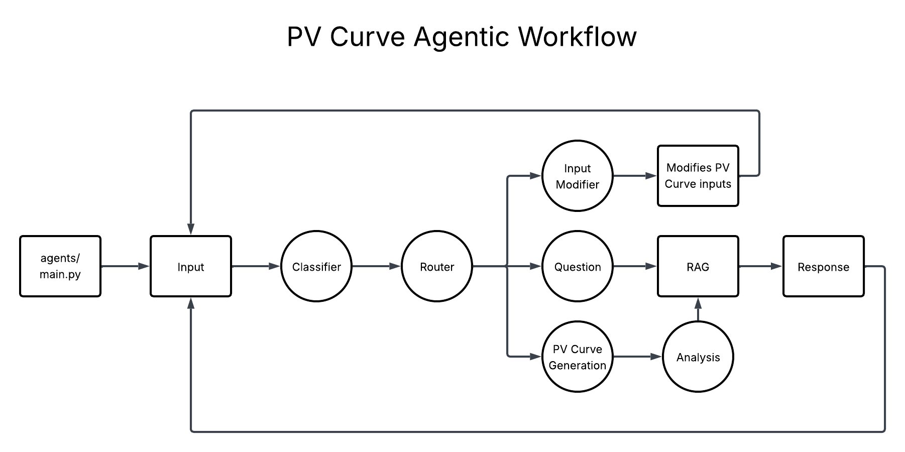

# P-V Curve LLM


Using LLMs to contextualize, create, and analyze Power-Voltage Curves (Nose Curves) for Power System Voltage Stability analysis. This project experiments with AI agents and to accomplish specific tasks with natural language.

[](https://github.com/CURENT/pv-curve-llm/blob/master/LICENSE)
[](https://www.repostatus.org/#active)
[](https://github.com/CURENT/pv-curve-llm/commits/master/)
[](https://visitorbadge.io/status?path=https%3A%2F%2Fgithub.com%2FCURENT%2Fpv-curve-llm)

# Installation & Run

### Prerequisites

- Python 3.8+
- Ollama installed: https://www.ollama.com/download

### Quick Start

```bash
# Run terminal as administrator
python -m venv venv
source venv/bin/activate  # Windows: venv\Scripts\activate
pip install -r requirements.txt
ollama pull mxbai-embed-large  # embedding model for RAG
ollama pull llama3.1:8b
ollama create pv-curve -f agent\Modelfile
python main.py
```

To leave the virtual environment, enter `deactivate`.

### Recommended: OpenAI instead of local Ollama

When running the application, you will be prompted to use 'openai' or 'ollama'. For improved performance, it is recommended to use OpenAI with an API key.

Create `agent/.env` with `OPENAI_API_KEY=your-key` (get a key at the [OpenAI API keys page](https://platform.openai.com/api-keys)).

# Custom vector database

To setup a custom vector database, see `agent/data/README.md`

### File Architecture

The `agent/` directory contains the core AI agent system with the following architecture:

**Core Entry Points:**
- `main.py` - Primary application entry point for local execution with terminal UI

**LLM Configuration & Prompts:**
- `Modelfile` - Ollama model configuration defining system behavior and example conversations
- `prompts.py` / `prompts_json.py` - Structured prompt templates for different agent functions (classification, parameter handling, generation, etc.)

**Data Layer:**
- `vector_db/` - Chroma vector database storing embedded knowledge for RAG retrieval
- `data/` - Training documents in markdown format covering power system theory and PV curve concepts
- `vector.py` - Interface layer for vector database operations and similarity search
- `train.py` - Script to process training data and build/update the vector database

**Workflow Orchestration:**
- `workflows/` - LangGraph workflow definitions coordinating agent behavior
  - `compound_workflow.py` - Complex multi-step task orchestration with planning and execution
  - `simple_workflow.py` - Basic single-step task routing and execution

**Processing Nodes:**
- `nodes/` - Individual processing units that handle specific agent functions
  - `classifier_nodes.py` - Message classification (question/parameter/generation) and routing logic
  - `parameter_nodes.py` - Parameter modification, validation, and state management
  - `execution_nodes.py` - Task execution including Q&A with RAG, parameter explanations, and analysis

**Data Models:**
- `models/` - Pydantic data structures defining system state and interfaces
  - `state_models.py` - Core state management and input parameter validation
  - `plan_models.py` - Multi-step plan structures for complex task decomposition

**Domain Logic:**
- `pv_curve/` - Power system simulation engine using pandapower for IEEE test systems
  - `pv_curve.py` - Core PV curve generation with voltage stability analysis

**Support Utilities:**
- `utils/common_utils.py` - Helper functions for state management and display formatting

# Agent Workflow



# License

This repository is licensed under the [MIT License](./LICENSE), unless specified otherwise in subdirectories.
